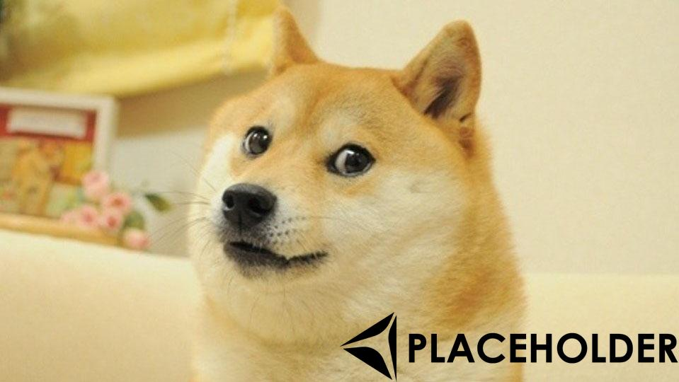
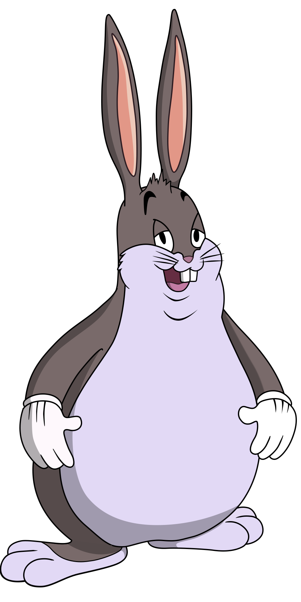

## Image Manipulation CLI

CLI written in Python that allows a user to alter images

### main functions:  
**1** - Add a given image (like a logo) to the bottom right of all images within a given directory  
takes up to 4 arguments  
call it like: `python main.py -bl <image_folder> <logo> <output_folder> .5`  
`-bl` indicates that we want to use the bulk logo add functionality  
`<image_folder>` is the path to the folder of images that you want to add the logo to  
`<logo>` is the path to the image file used as the logo  
`<output_folder>` (optional) is where the new files with the logo added will be saved, defaults to "./output_folder"  
`.5` (optional) indicates the maximum ratio of the original image that one of the dimensions of the logo will take up

**2** - Cut image into squares for use in giga emojis on slack and discord  
call it like: `python main.py -if <input_image_file> -of <output_file> -c 2 3`  
`-if` indicates that we want to alter/manipulate a single image  
`<input_image_file>` is the path to the input image  
`-of` (optional) indicates that we want to supply a base file name to save the image(s) to  
`<output_file>` is a path to the output file(s)  
`-c` indicates that we want to cut this image into squares  
`2` (optional) indicates that we want to cut the image into 2 equal columns, if ommitted will result in cutting into 2x2 grid  
`3` (optional) indicates that we want to cut the image into 3 equal rows, if ommitted will rely on the first number for both the columns and rows  
if the image aspect ratio doesn't match the ratio of the given dimensions, a prompt will indicate this and ask if you'd like to proceed anyways  
eg. we can turn a beloved meme:  
  
into a large emoji in slack:  
  
there are also tags such as `-vt` and `-ht` that vertically and horizontally transpose the image, respectively, and `-gs` which turns the image to grayscale  
a list and explanation of all the tags and arguments can be seen by running `python main.py -h` to see the help text
